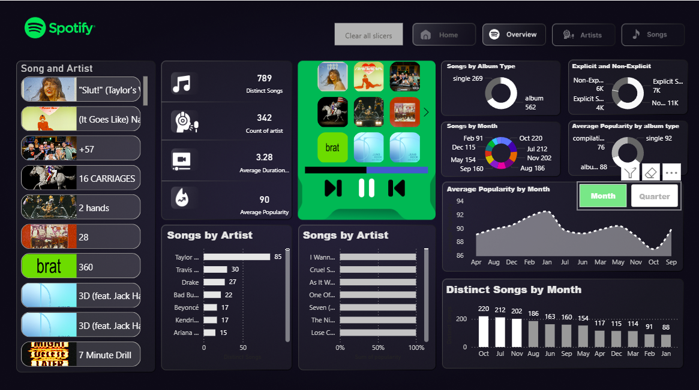

# 🎧 Spotify Music Analytics Dashboard

## 📊 Overview
This project is an interactive Spotify analytics dashboard built to analyze music streaming data, uncover listening patterns, and visualize artist and song performance. It helps understand user behavior through data-driven insights.

---

## 🎯 Objective
To analyze Spotify music data and create meaningful visual insights that help understand trends in songs, artists, popularity, and listening behavior.

---

## 🛠️ Tools & Technologies
- Power BI / Tableau  
- Excel / Python (Data Cleaning & Preparation)  
- Data Visualization  
- Data Analysis  

---

## 📁 Dataset
- ~700–800 songs analyzed  
- Includes attributes like artist, album, popularity, explicit content, and duration  

---

## 📌 Key Insights
- 🎵 Total distinct songs analyzed: 789  
- 👨‍🎤 300+ artists included  
- 📈 Monthly listening trends identified  
- 🔥 Most popular artists and tracks highlighted  
- ⚡ Explicit vs non-explicit song distribution  
- 💿 Album vs single performance comparison  
- 📊 Average popularity trends across months  

---

## 📊 Dashboard Features
- Interactive filters (songs, artists, albums)  
- Artist-wise performance analysis  
- Monthly trend visualization  
- Popularity scoring system  
- Clean and user-friendly UI  
- Dynamic charts for better insights  

---

## 🖼️ Dashboard Preview

---

## 💡 Business Impact
This dashboard helps in understanding:
- User music preferences  
- Trending artists and songs  
- Content popularity patterns  
- Data-driven decision-making for music recommendations  

---

## 🚀 Skills Demonstrated
- Data Cleaning  
- Data Visualization  
- Business Intelligence  
- Analytical Thinking  
- Dashboard Design  

---

## 🔗 Connect with Me
LinkedIn: https://www.linkedin.com/posts/abhishekpakhare_dataanalytics-datascience-powerbi-ugcPost-7468329005276950528-bG4C/?utm_source=share&utm_medium=member_ios&rcm=ACoAAFEJ7QYBM9IGuSUxjFB3DnfHAQVyFrFpynw
